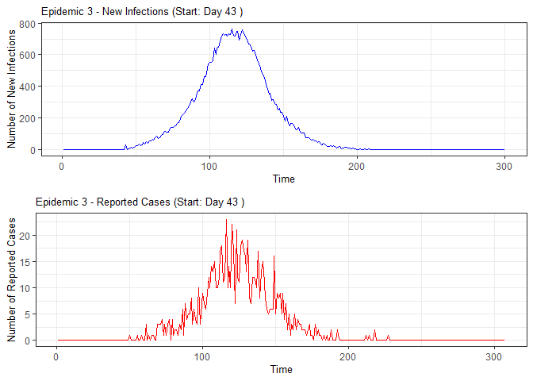
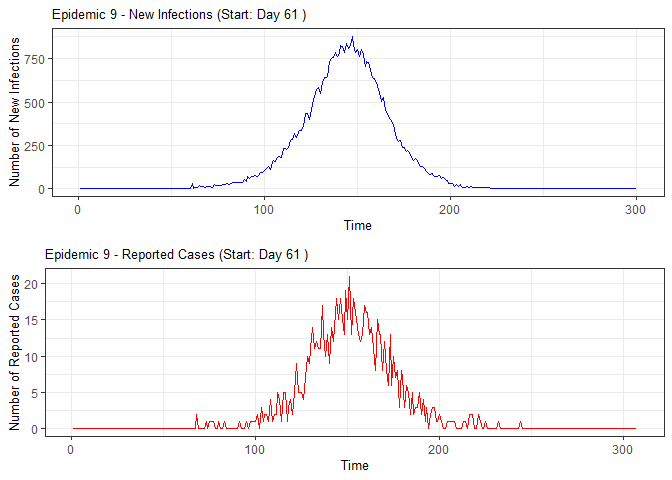
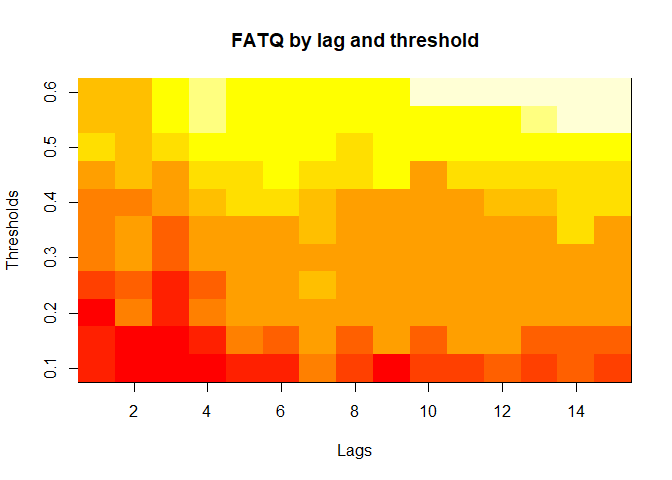
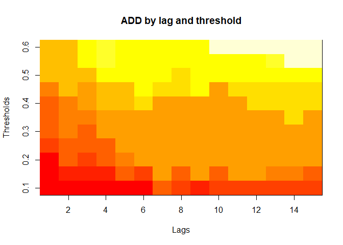
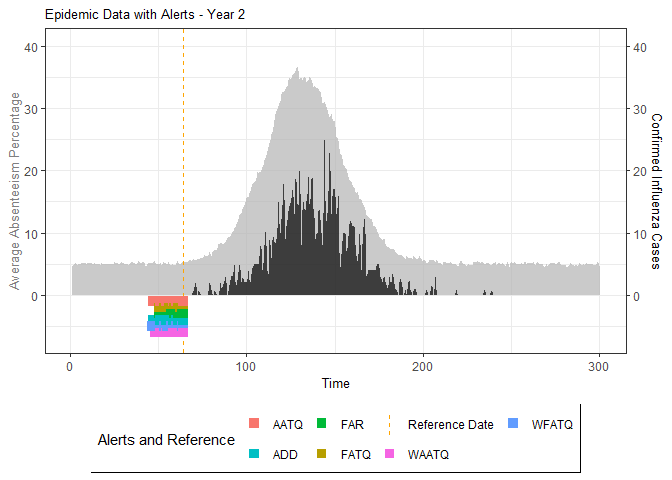
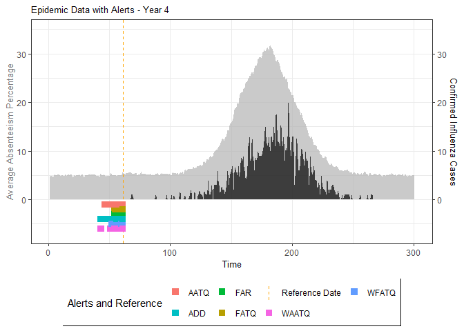
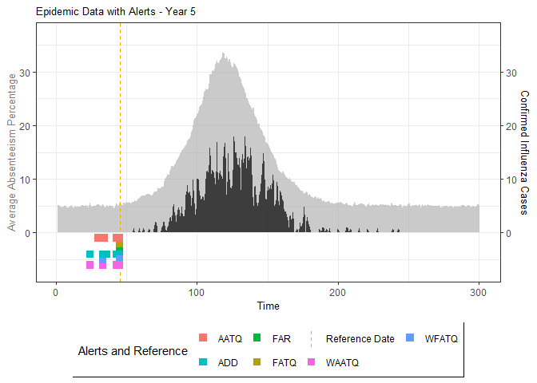
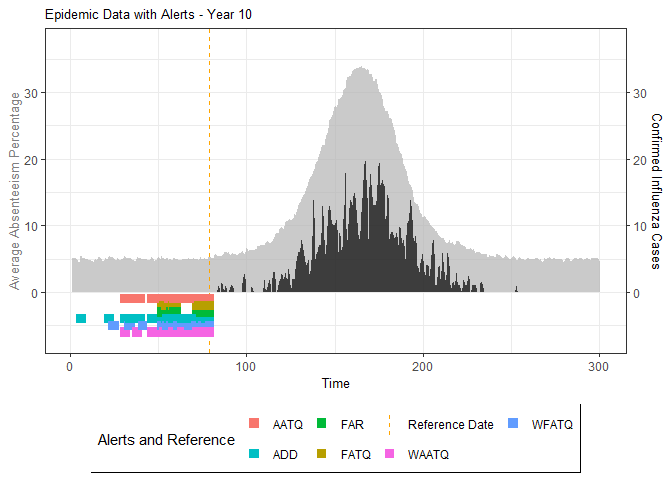

<!-- README.md is generated from README.Rmd. Please edit that file -->

# ATQ: Assesing Evaluation Metrics for Timely Epidemic Detection Models

## Background

Madeline A. Ward published a
[paper](https://bmcpublichealth.biomedcentral.com/articles/10.1186/s12889-019-7521-7)
on methods for detecting seasonal influenza epidemics using school
absenteeism data. The premise is that there is a school absenteeism
surveillance system established in Wellington-Dufferin-Guelph which uses
a threshold-based (10% of students absent) approach to raise alarms for
school illness outbreaks to implement mitigating measures. Two metrics
(FAR and ADD) are proposed in that study that were found to be more
accurate.

Based on the work of Madeline, in 2021 Kayla Vanderkruk along with Drs.
Deeth and Feng wrote a
[paper](https://bmcpublichealth.biomedcentral.com/articles/10.1186/s12889-023-15747-z)
on improved metrics, namely ATQ (alert time quality), that are more
accurate and timely than the FAR-selected models. This package is based
off Kayla’s work that can be found
[here](https://github.com/vanderkk/School_Abstenteeism_Based_Influenza_Surveillance_Simulation_Study).
ATQ study assessed alarms on a gradient, where alarms raised
incrementally before or after an optimal date were penalized for lack of
timeliness.

This ATQ package will allow users to perform simulation studies and
evaluate ATQ & FAR based metrics from them. The simulation study will
require information from census data for a region such as distribution
of number of household members, households with and without children,
and age category, etc.

This package is still a work in progress and future considerations
include streamlining simulation study workflow and generalizing
evaluation of metrics to include real data sets.

## Installation:

You can install the development version of ATQ from
[Github](https://github.com/vjoshy/ATQ_Surveillance_Package)

``` r
#install.packages("devtools")
library(devtools)
install_github("vjoshy/ATQ_Surveillance_Package")
```

## Key Functions

The ATQ package includes the following main functions:

1.  `catchment_sim()`
    - Simulates catchment area data
2.  `elementary_pop()`
    - Simulates elementary school populations
3.  `subpop_children()`
    - Simulates households with children
4.  `subpop_noChildren()`
    - Simulates households without children
5.  `simulate_households()`
    - Combines household simulations
6.  `ssir()`
    - Simulates epidemic using SSIR model
7.  `compile_epi()`
    - Compiles absenteeism data
8.  `eval_metrics()`
    - Evaluates alarm metrics
9.  `plot()` and `summary()`
    - Methods for visualizing and summarizing results

Additionally, the package implements S3 methods for generic functions:

9.  `plot()` and `summary()`
    - These methods are extended for objects returned by `ssir()` and
      `eval_metrics()`
    - `plot()` provides visualizations of epidemic simulations and
      metric evaluations
    - `summary()` offers concise summaries of the simulation results and
      metric assessments

These functions and methods work together to facilitate comprehensive
epidemic simulation and evaluation of detection models

Please see example below:

``` r
# Load the ATQ package
library(ATQ)

#Simulate number of elementary schools in each catchment
catch_df <- catchment_sim(16, 4.68, 3.01, 5)

# Simulate elementary school populations for each catchment area
elementary_df <- elementary_pop(catch_df, 5.86, 0.01)

# Set up file connection to simulate user input for subpop_children() function
f <- file()
lines <- c(0.7668901,0.3634045, 0.4329440, 0.2036515,0.5857832, 0.3071523, 0.1070645,0.4976825)
ans <- paste(lines, collapse = "\n")
write(ans, f)
options("usr_con" = f) # Set connection option to use file instead of stdin

# Simulate households with children
house_children <- subpop_children(elementary_df, n = 2)
#> Please enter proportion of parents as a couple: Enter proportion of coupled parents with 1, 2, 3+ children separated by space:Enter proportion of single parents with 1, 2, 3+ children separated by space:Please enter proportion of children that are of elementary school age:

# Prepare input for subpop_noChildren() function
lines <- c(0.23246269, 0.34281716, 0.16091418, 0.16427239, 0.09953358, 0.4277052)
ans <- paste(lines, collapse = "\n")
write(ans, f)

# Simulate households without children
house_nochildren <- subpop_noChildren(house_children, elementary_df)
#> Please enter proportion of households with 1, 2, 3, 4, 5+ members separted by space: Please enter proportion of households with children:

# Clean up file connection
close(f)
options("usr_con" = stdin()) # Reset connection option to standard input

# Combine household simulations and generate individual-level data
simulation <- simulate_households(house_children, house_nochildren)

# Extract individual-level data
individuals <- simulation$individual_sim

# Simulate epidemic using SSIR (Stochastic Susceptible-Infectious-Recovered) model
epidemic <- ssir(nrow(individuals), T = 300, alpha = 0.298, inf_init = 32, rep = 10)

# Summarize and plot the epidemic simulation results
summary(epidemic)
#> SSIR Epidemic Summary (Multiple Simulations):
#> Number of simulations: 10 
#> 
#> Average total infected: 47897.2 
#> Average total reported cases: 961.3 
#> Average peak infected: 3537.6 
#> 
#> Model parameters:
#> $N
#> [1] 157544
#> 
#> $T
#> [1] 300
#> 
#> $alpha
#> [1] 0.298
#> 
#> $inf_period
#> [1] 4
#> 
#> $inf_init
#> [1] 32
#> 
#> $report
#> [1] 0.02
#> 
#> $lag
#> [1] 7
#> 
#> $rep
#> [1] 10
plot(epidemic)
```



``` r

# Compile absenteeism data based on epidemic simulation and individual data
absent_data <- compile_epi(epidemic, individuals)

# Display structure of absenteeism data
dplyr::glimpse(absent_data)
#> Rows: 3,000
#> Columns: 28
#> $ Date        <int> 1, 2, 3, 4, 5, 6, 7, 8, 9, 10, 11, 12, 13, 14, 15, 16, 17,…
#> $ ScYr        <int> 1, 1, 1, 1, 1, 1, 1, 1, 1, 1, 1, 1, 1, 1, 1, 1, 1, 1, 1, 1…
#> $ pct_absent  <dbl> 0.05083952, 0.04989393, 0.04901167, 0.04987701, 0.04879853…
#> $ absent      <dbl> 858, 850, 842, 853, 830, 865, 903, 891, 820, 879, 896, 912…
#> $ absent_sick <dbl> 0, 0, 0, 0, 0, 0, 0, 0, 0, 0, 0, 0, 0, 0, 0, 0, 0, 0, 0, 0…
#> $ new_inf     <dbl> 0, 0, 0, 0, 0, 0, 0, 0, 0, 0, 0, 0, 0, 0, 0, 0, 0, 0, 0, 0…
#> $ lab_conf    <dbl> 0, 0, 0, 0, 0, 0, 0, 0, 0, 0, 0, 0, 0, 0, 0, 0, 0, 0, 0, 0…
#> $ Case        <dbl> 0, 0, 0, 0, 0, 0, 0, 0, 0, 0, 0, 0, 0, 0, 0, 0, 0, 0, 0, 0…
#> $ sinterm     <dbl> 0.01720158, 0.03439806, 0.05158437, 0.06875541, 0.08590610…
#> $ costerm     <dbl> 0.9998520, 0.9994082, 0.9986686, 0.9976335, 0.9963032, 0.9…
#> $ window      <dbl> 0, 0, 0, 0, 0, 0, 0, 0, 0, 0, 0, 0, 0, 0, 0, 0, 0, 0, 0, 0…
#> $ ref_date    <dbl> 0, 0, 0, 0, 0, 0, 0, 0, 0, 0, 0, 0, 0, 0, 0, 0, 0, 0, 0, 0…
#> $ lag0        <dbl> 0.05083952, 0.04989393, 0.04901167, 0.04987701, 0.04879853…
#> $ lag1        <dbl> NA, 0.05083952, 0.04989393, 0.04901167, 0.04987701, 0.0487…
#> $ lag2        <dbl> NA, NA, 0.05083952, 0.04989393, 0.04901167, 0.04987701, 0.…
#> $ lag3        <dbl> NA, NA, NA, 0.05083952, 0.04989393, 0.04901167, 0.04987701…
#> $ lag4        <dbl> NA, NA, NA, NA, 0.05083952, 0.04989393, 0.04901167, 0.0498…
#> $ lag5        <dbl> NA, NA, NA, NA, NA, 0.05083952, 0.04989393, 0.04901167, 0.…
#> $ lag6        <dbl> NA, NA, NA, NA, NA, NA, 0.05083952, 0.04989393, 0.04901167…
#> $ lag7        <dbl> NA, NA, NA, NA, NA, NA, NA, 0.05083952, 0.04989393, 0.0490…
#> $ lag8        <dbl> NA, NA, NA, NA, NA, NA, NA, NA, 0.05083952, 0.04989393, 0.…
#> $ lag9        <dbl> NA, NA, NA, NA, NA, NA, NA, NA, NA, 0.05083952, 0.04989393…
#> $ lag10       <dbl> NA, NA, NA, NA, NA, NA, NA, NA, NA, NA, 0.05083952, 0.0498…
#> $ lag11       <dbl> NA, NA, NA, NA, NA, NA, NA, NA, NA, NA, NA, 0.05083952, 0.…
#> $ lag12       <dbl> NA, NA, NA, NA, NA, NA, NA, NA, NA, NA, NA, NA, 0.05083952…
#> $ lag13       <dbl> NA, NA, NA, NA, NA, NA, NA, NA, NA, NA, NA, NA, NA, 0.0508…
#> $ lag14       <dbl> NA, NA, NA, NA, NA, NA, NA, NA, NA, NA, NA, NA, NA, NA, 0.…
#> $ lag15       <dbl> NA, NA, NA, NA, NA, NA, NA, NA, NA, NA, NA, NA, NA, NA, NA…

# Evaluate alarm metrics for epidemic detection
alarm_metrics <- eval_metrics(absent_data, thres = seq(0.1,0.6,by = 0.05),
                              ScYr = c(2:10), yr.weights = c(1:9)/sum(c(1:9)))

# Plot various alarm metrics
plot(alarm_metrics$metrics, "FAR")   # False Alert Rate
```


``` r
plot(alarm_metrics$metrics, "FATQ")  # First Alert Time Quality
```



``` r
plot(alarm_metrics$metrics, "AATQ")  # Average Alert Time Quality
```


``` r
plot(alarm_metrics$metrics, "WAATQ") # Weighted Average Alert Time Quality
```


``` r
plot(alarm_metrics$metrics, "WFATQ") # Weighted First Alert Time Quality
```


``` r
plot(alarm_metrics$metrics, "ADD")   # Accumulated Delay Days
```



``` r


# Summarize alarm metrics
summary(alarm_metrics$summary)
#> Alarm Metrics Summary
#> =====================
#> 
#> FAR :
#>   Mean: 0.5538 
#>   Variance: 0.0044 
#>   Best lag: 14 
#>   Best threshold: 0.25 
#>   Best value: 0.4121 
#> 
#> ADD :
#>   Mean: 20.2613 
#>   Variance: 28.3687 
#>   Best lag: 1 
#>   Best threshold: 0.1 
#>   Best value: 9.6667 
#> 
#> AATQ :
#>   Mean: 0.4169 
#>   Variance: 0.0076 
#>   Best lag: 1 
#>   Best threshold: 0.1 
#>   Best value: 0.2361 
#> 
#> FATQ :
#>   Mean: 0.4454 
#>   Variance: 0.0043 
#>   Best lag: 14 
#>   Best threshold: 0.15 
#>   Best value: 0.3159 
#> 
#> WAATQ :
#>   Mean: 0.393 
#>   Variance: 0.0104 
#>   Best lag: 1 
#>   Best threshold: 0.1 
#>   Best value: 0.1799 
#> 
#> WFATQ :
#>   Mean: 0.4426 
#>   Variance: 0.0065 
#>   Best lag: 14 
#>   Best threshold: 0.25 
#>   Best value: 0.3022 
#> 
#> Reference Dates:
#>    epidemic_years ref_dates
#> 1               1        60
#> 2               2        55
#> 3               3        40
#> 4               4        46
#> 5               5        47
#> 6               6        67
#> 7               7        83
#> 8               8        47
#> 9               9        63
#> 10             10        81
#> 
#> Best Prediction Dates:
#> FAR :
#>  [1] NA 50 NA 46 44 54 55 NA 58 61
#> 
#> ADD :
#>  [1] NA 52 NA 45 42 42 36 47 45 46
#> 
#> AATQ :
#>  [1] NA 52 NA 45 42 42 36 47 45 46
#> 
#> FATQ :
#>  [1] NA 50 NA 41 44 49 54 NA 47 59
#> 
#> WAATQ :
#>  [1] NA 52 NA 45 42 42 36 47 45 46
#> 
#> WFATQ :
#>  [1] NA 50 NA 46 44 54 55 NA 58 61

# Generate and display plots for alarm metrics across epidemic years
alarm_plots <- plot(alarm_metrics$plot_data)
for(i in seq_along(alarm_plots)) { 
  print(alarm_plots[[i]]) 
}
```



    #> Warning: Removed 7 rows containing missing values (`geom_col()`).



    #> Warning: Removed 12 rows containing missing values (`geom_col()`).



    #> Warning: Removed 52 rows containing missing values (`geom_col()`).


    #> Warning: Removed 88 rows containing missing values (`geom_col()`).


    #> Warning: Removed 27 rows containing missing values (`geom_col()`).


    #> Warning: Removed 117 rows containing missing values (`geom_col()`).



The final output ‘region_metric’ will be a list of 6 matrices and 6 data
frames. The matrices describe the values of metrics for respective lag
and thresholds.

An optimal lag and threshold value that minimizes each metric is
selected and these optimal parameters are used to generate the 6 data
frames associated with the metrics. Simulated information like number of
lab confirmed cases, number of students absent, etc, are included in the
output.

These data frames contain 19 variables and are as follows:

- lag, Best selected lagged absenteeism value.
- thres, Best selected threshold value.
- Data, Day (1-300).
- ScYr, School year.
- Actual.case, Total number of true cases (unconfirmed).
- case.elem, Number of true cases that are elementary school children.
- Case.No, Number of lab confirmed cases.
- Case, Binary variable to indicate whether there has been a lab
  confirmed case for the day.
- pct.absent, Percent of students absent in total school population.
- absent, Total number of students absent.
- absent.sick, Total number of students absent due to illness.
- window, 14 day true alarm window for ADD and FAR calculations (binary
  variable).
- ref.date, Reference date (first day where there are two lab confirmed
  cases in a 7 day period).
- Alarm, Binary variable indicating whether alarm was raised (1 -
  raised, 0 - not raised).
- ATQ, Alert time quality (metric).
- FAR, False alarm rate (metric).
- ADD, Accumulated days delayed (metric).
- AATQ, Average alarm time quality (metric).
- FATQ, First alarm time quality (metric).
