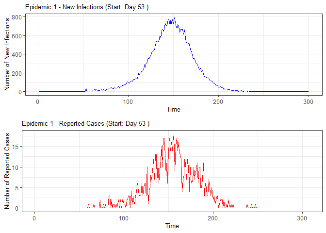
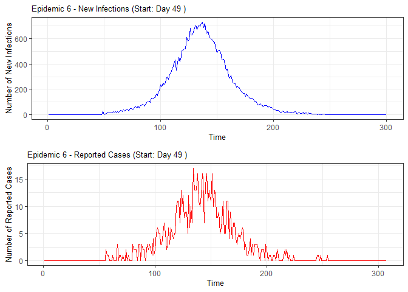
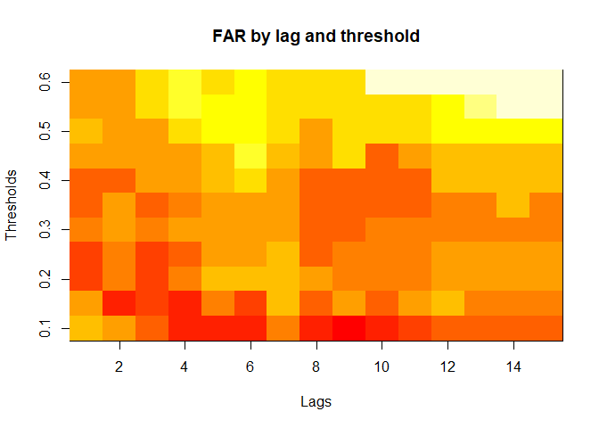
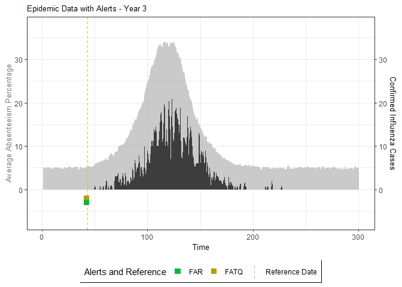
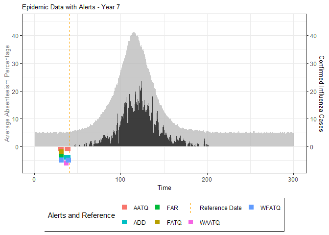

<!-- README.md is generated from README.Rmd. Please edit that file -->

# ATQ: Assesing Evaluation Metrics for Timely Epidemic Detection Models

## Background

Madeline A. Ward published a
[paper](https://bmcpublichealth.biomedcentral.com/articles/10.1186/s12889-019-7521-7)
on methods for detecting seasonal influenza epidemics using school
absenteeism data. The premise is that there is a school absenteeism
surveillance system established in Wellington-Dufferin-Guelph which uses
a threshold-based (10% of students absent) approach to raise alarms for
school illness outbreaks to implement mitigating measures. Two metrics
(FAR and ADD) are proposed in that study that were found to be more
accurate.

Based on the work of Madeline, in 2021 Kayla Vanderkruk along with Drs.
Deeth and Feng wrote a
[paper](https://bmcpublichealth.biomedcentral.com/articles/10.1186/s12889-023-15747-z)
on improved metrics, namely ATQ (alert time quality), that are more
accurate and timely than the FAR-selected models. This package is based
off Kayla’s work that can be found
[here](https://github.com/vanderkk/School_Abstenteeism_Based_Influenza_Surveillance_Simulation_Study).
ATQ study assessed alarms on a gradient, where alarms raised
incrementally before or after an optimal date were penalized for lack of
timeliness.

This ATQ package will allow users to perform simulation studies and
evaluate ATQ & FAR based metrics from them. The simulation study will
require information from census data for a region such as distribution
of number of household members, households with and without children,
and age category, etc.

This package is still a work in progress and future considerations
include streamlining simulation study workflow and generalizing
evaluation of metrics to include real data sets.

## Installation:

You can install the development version of ATQ from
[Github](https://github.com/vjoshy/ATQ_Surveillance_Package)

``` r
#install.packages("devtools")
library(devtools)
install_github("vjoshy/ATQ_Surveillance_Package")
```

## Key Functions

The ATQ package includes the following main functions:

1.  `catchment_sim()`
    - Simulates catchment area data
2.  `elementary_pop()`
    - Simulates elementary school populations
3.  `subpop_children()`
    - Simulates households with children
4.  `subpop_noChildren()`
    - Simulates households without children
5.  `simulate_households()`
    - Combines household simulations
6.  `ssir()`
    - Simulates epidemic using SSIR model
7.  `compile_epi()`
    - Compiles absenteeism data
8.  `eval_metrics()`
    - Evaluates alarm metrics
9.  `plot()` and `summary()`
    - Methods for visualizing and summarizing results

Additionally, the package implements S3 methods for generic functions:

9.  `plot()` and `summary()`
    - These methods are extended for objects returned by `ssir()` and
      `eval_metrics()`
    - `plot()` provides visualizations of epidemic simulations and
      metric evaluations
    - `summary()` offers concise summaries of the simulation results and
      metric assessments

These functions and methods work together to facilitate comprehensive
epidemic simulation and evaluation of detection models

Please see example below:

``` r
# Load the ATQ package
library(ATQ)

#Simulate number of elementary schools in each catchment
catch_df <- catchment_sim(16, 5, shape = 4.68, rate = 3.01)

# Simulate elementary school populations for each catchment area
elementary_df <- elementary_pop(catch_df, shape = 5.86, rate = 0.01)

# Simulate households with children
house_children <- subpop_children(elementary_df, n = 2,
                                  prop_parent_couple = 0.7,
                                  prop_children_couple = c(0.3, 0.5, 0.2),
                                  prop_children_lone = c(0.4, 0.4, 0.2),
                                  prop_elem_age = 0.6)

# Simulate households without children
house_nochildren <-  subpop_noChildren(house_children, elementary_df,
                                   prop_house_size = c(0.2, 0.3, 0.25, 0.15, 0.1),
                                   prop_house_Children = 0.3)

# Combine household simulations and generate individual-level data
simulation <- simulate_households(house_children, house_nochildren)

# Extract individual-level data
individuals <- simulation$individual_sim

# Simulate epidemic using SSIR (Stochastic Susceptible-Infectious-Recovered) model
epidemic <- ssir(nrow(individuals), T = 300, alpha = 0.298, inf_init = 32, rep = 10)

# Summarize and plot the epidemic simulation results
summary(epidemic)
#> SSIR Epidemic Summary (Multiple Simulations):
#> Number of simulations: 10 
#> 
#> Average total infected: 60047.7 
#> Average total reported cases: 1190.7 
#> Average peak infected: 4325.2 
#> 
#> Model parameters:
#> $N
#> [1] 197227
#> 
#> $T
#> [1] 300
#> 
#> $alpha
#> [1] 0.298
#> 
#> $inf_period
#> [1] 4
#> 
#> $inf_init
#> [1] 32
#> 
#> $report
#> [1] 0.02
#> 
#> $lag
#> [1] 7
#> 
#> $rep
#> [1] 10
plot(epidemic)
```



``` r

# Compile absenteeism data based on epidemic simulation and individual data
absent_data <- compile_epi(epidemic, individuals)

# Display structure of absenteeism data
dplyr::glimpse(absent_data)
#> Rows: 3,000
#> Columns: 28
#> $ Date        <int> 1, 2, 3, 4, 5, 6, 7, 8, 9, 10, 11, 12, 13, 14, 15, 16, 17,…
#> $ ScYr        <int> 1, 1, 1, 1, 1, 1, 1, 1, 1, 1, 1, 1, 1, 1, 1, 1, 1, 1, 1, 1…
#> $ pct_absent  <dbl> 0.04925325, 0.04640617, 0.04858373, 0.04855402, 0.04963313…
#> $ absent      <dbl> 792, 744, 786, 776, 794, 769, 785, 783, 758, 793, 771, 829…
#> $ absent_sick <dbl> 0, 0, 0, 0, 0, 0, 0, 0, 0, 0, 0, 0, 0, 0, 0, 0, 0, 0, 0, 0…
#> $ new_inf     <dbl> 0, 0, 0, 0, 0, 0, 0, 0, 0, 0, 0, 0, 0, 0, 0, 0, 0, 0, 0, 0…
#> $ lab_conf    <dbl> 0, 0, 0, 0, 0, 0, 0, 0, 0, 0, 0, 0, 0, 0, 0, 0, 0, 0, 0, 0…
#> $ Case        <dbl> 0, 0, 0, 0, 0, 0, 0, 0, 0, 0, 0, 0, 0, 0, 0, 0, 0, 0, 0, 0…
#> $ sinterm     <dbl> 0.01720158, 0.03439806, 0.05158437, 0.06875541, 0.08590610…
#> $ costerm     <dbl> 0.9998520, 0.9994082, 0.9986686, 0.9976335, 0.9963032, 0.9…
#> $ window      <dbl> 0, 0, 0, 0, 0, 0, 0, 0, 0, 0, 0, 0, 0, 0, 0, 0, 0, 0, 0, 0…
#> $ ref_date    <dbl> 0, 0, 0, 0, 0, 0, 0, 0, 0, 0, 0, 0, 0, 0, 0, 0, 0, 0, 0, 0…
#> $ lag0        <dbl> 0.04925325, 0.04640617, 0.04858373, 0.04855402, 0.04963313…
#> $ lag1        <dbl> NA, 0.04925325, 0.04640617, 0.04858373, 0.04855402, 0.0496…
#> $ lag2        <dbl> NA, NA, 0.04925325, 0.04640617, 0.04858373, 0.04855402, 0.…
#> $ lag3        <dbl> NA, NA, NA, 0.04925325, 0.04640617, 0.04858373, 0.04855402…
#> $ lag4        <dbl> NA, NA, NA, NA, 0.04925325, 0.04640617, 0.04858373, 0.0485…
#> $ lag5        <dbl> NA, NA, NA, NA, NA, 0.04925325, 0.04640617, 0.04858373, 0.…
#> $ lag6        <dbl> NA, NA, NA, NA, NA, NA, 0.04925325, 0.04640617, 0.04858373…
#> $ lag7        <dbl> NA, NA, NA, NA, NA, NA, NA, 0.04925325, 0.04640617, 0.0485…
#> $ lag8        <dbl> NA, NA, NA, NA, NA, NA, NA, NA, 0.04925325, 0.04640617, 0.…
#> $ lag9        <dbl> NA, NA, NA, NA, NA, NA, NA, NA, NA, 0.04925325, 0.04640617…
#> $ lag10       <dbl> NA, NA, NA, NA, NA, NA, NA, NA, NA, NA, 0.04925325, 0.0464…
#> $ lag11       <dbl> NA, NA, NA, NA, NA, NA, NA, NA, NA, NA, NA, 0.04925325, 0.…
#> $ lag12       <dbl> NA, NA, NA, NA, NA, NA, NA, NA, NA, NA, NA, NA, 0.04925325…
#> $ lag13       <dbl> NA, NA, NA, NA, NA, NA, NA, NA, NA, NA, NA, NA, NA, 0.0492…
#> $ lag14       <dbl> NA, NA, NA, NA, NA, NA, NA, NA, NA, NA, NA, NA, NA, NA, 0.…
#> $ lag15       <dbl> NA, NA, NA, NA, NA, NA, NA, NA, NA, NA, NA, NA, NA, NA, NA…

# Evaluate alarm metrics for epidemic detection
alarm_metrics <- eval_metrics(absent_data, thres = seq(0.1,0.6,by = 0.05),
                              ScYr = c(2:10), yr.weights = c(1:9)/sum(c(1:9)))

# Plot various alarm metrics
plot(alarm_metrics$metrics, "FAR")   # False Alert Rate
```



``` r
plot(alarm_metrics$metrics, "FATQ")  # First Alert Time Quality
```


``` r
plot(alarm_metrics$metrics, "AATQ")  # Average Alert Time Quality
```


``` r
plot(alarm_metrics$metrics, "WAATQ") # Weighted Average Alert Time Quality
```


``` r
plot(alarm_metrics$metrics, "WFATQ") # Weighted First Alert Time Quality
```


``` r
plot(alarm_metrics$metrics, "ADD")   # Accumulated Delay Days
```


``` r


# Summarize alarm metrics
summary(alarm_metrics$summary)
#> Alarm Metrics Summary
#> =====================
#> 
#> FAR :
#>   Mean: 0.8241 
#>   Variance: 0.0135 
#>   Best lag: 10 
#>   Best threshold: 0.15 
#>   Best value: 0.5278 
#> 
#> ADD :
#>   Mean: 32.2061 
#>   Variance: 32.0479 
#>   Best lag: 1 
#>   Best threshold: 0.1 
#>   Best value: 19.2222 
#> 
#> AATQ :
#>   Mean: 0.7761 
#>   Variance: 0.0149 
#>   Best lag: 12 
#>   Best threshold: 0.1 
#>   Best value: 0.4856 
#> 
#> FATQ :
#>   Mean: 0.7984 
#>   Variance: 0.0134 
#>   Best lag: 10 
#>   Best threshold: 0.15 
#>   Best value: 0.5082 
#> 
#> WAATQ :
#>   Mean: 0.8538 
#>   Variance: 0.0178 
#>   Best lag: 1 
#>   Best threshold: 0.1 
#>   Best value: 0.5087 
#> 
#> WFATQ :
#>   Mean: 0.8614 
#>   Variance: 0.0175 
#>   Best lag: 1 
#>   Best threshold: 0.1 
#>   Best value: 0.5213 
#> 
#> Reference Dates:
#>    epidemic_years ref_dates
#> 1               1        49
#> 2               2        43
#> 3               3        68
#> 4               4        65
#> 5               5        40
#> 6               6        48
#> 7               7        42
#> 8               8        43
#> 9               9        52
#> 10             10        22
#> 
#> Best Prediction Dates:
#> FAR :
#>  [1] NA 38 42 56 NA NA NA 43 45 NA
#> 
#> ADD :
#>  [1] NA NA 36 45 NA 48 NA 41 42 NA
#> 
#> AATQ :
#>  [1] NA 39 39 56 NA NA NA 26 45 NA
#> 
#> FATQ :
#>  [1] NA 38 42 56 NA NA NA 43 45 NA
#> 
#> WAATQ :
#>  [1] NA NA 36 45 NA 48 NA 41 42 NA
#> 
#> WFATQ :
#>  [1] NA NA 36 45 NA 48 NA 41 42 NA

# Generate and display plots for alarm metrics across epidemic years
alarm_plots <- plot(alarm_metrics$plot_data)
for(i in seq_along(alarm_plots)) { 
  print(alarm_plots[[i]]) 
}
```


    #> Warning: Removed 19 rows containing missing values or values outside the scale range
    #> (`geom_col()`).



    #> Warning: Removed 37 rows containing missing values or values outside the scale range
    #> (`geom_col()`).



    #> Warning: Removed 5 rows containing missing values or values outside the scale range
    #> (`geom_col()`).


    #> Warning: Removed 4 rows containing missing values or values outside the scale range
    #> (`geom_col()`).


The final output ‘region_metric’ will be a list of 6 matrices and 6 data
frames. The matrices describe the values of metrics for respective lag
and thresholds.

An optimal lag and threshold value that minimizes each metric is
selected and these optimal parameters are used to generate the 6 data
frames associated with the metrics. Simulated information like number of
lab confirmed cases, number of students absent, etc, are also included
in the output.
