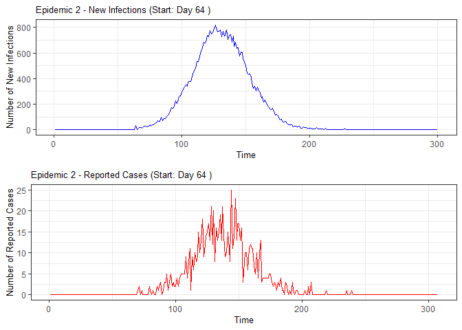
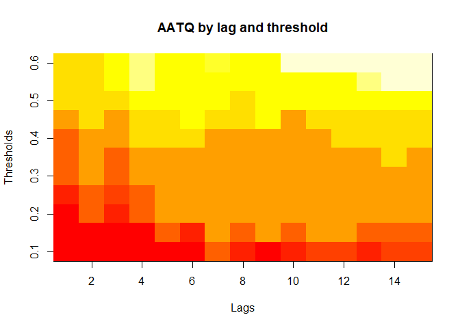
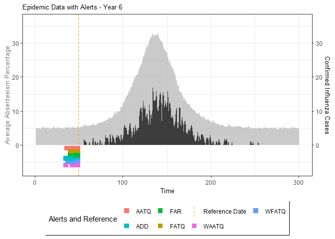
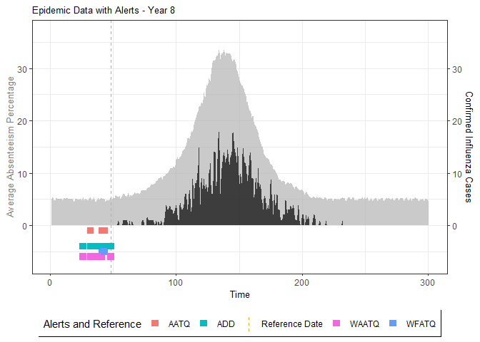
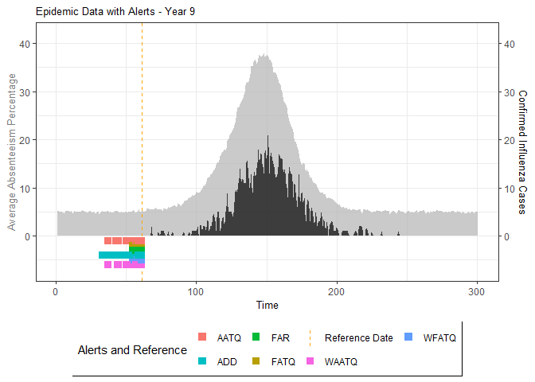

<!-- README.md is generated from README.Rmd. Please edit that file -->

# DESA: Detecting Epidemics using School Absenteeism <badges go here>

## Overview

DESA provides a comprehensive framework for early epidemic detection
through school absenteeism surveillance. The package enables:

1.  **Simulation**: Generate realistic populations, epidemic spread
    patterns, and resulting school absenteeism data
2.  **Detection**: Implement surveillance models that raise timely
    alerts for impending epidemics
3.  **Evaluation**: Assess and optimize detection models using metrics
    that balance timeliness and accuracy

The methods implemented are based on research by [Vanderkruk et
al. (2023)](https://bmcpublichealth.biomedcentral.com/articles/10.1186/s12889-023-15747-z)
and [Ward et
al. (2019)](https://bmcpublichealth.biomedcentral.com/articles/10.1186/s12889-019-7521-7).

## Why School Absenteeism?

Children typically have higher influenza infection rates than other age
groups and are encouraged to stay home when ill.This makes school
absenteeism data a valuable early indicator of community-wide epidemic
arrival, potentially providing public health officials with crucial lead
time to implement mitigation strategies.

## Background

Traditional epidemic surveillance systems often rely on
laboratory-confirmed cases, which can introduce significant delays in
detection. To address this limitation, Ward et al. (2019) investigated
the use of school absenteeism data for early epidemic detection in the
Wellington-Dufferin-Guelph region of Ontario, Canada.

The existing system in this region used a simple threshold-based
approach (raising an alarm when 10% of students were absent) to identify
potential outbreaks. Ward et al. developed detection models and
introduced two evaluation metrics:

- **False Alert Rate (FAR)**: Measures the proportion of incorrectly
  raised alarms
- **Accumulated Days Delayed (ADD)**: Quantifies the timeliness of
  correct alarms

Building on this foundation, Vanderkruk et al. (2023) developed a more
nuanced evaluation framework called **Alert Time Quality (ATQ)**. Unlike
the binary classification of previous metrics, ATQ assesses alerts where
ones that are raised at sub optimal times receive penalties proportional
to their deviation from the ideal alert time. This approach balances
both accuracy and timeliness in a single metric.

The DESA package implements the methodologies from both papers, enabling
users to:

1.  Generate simulations of population structures based on regional
    census data
2.  Apply various detection models to simulated epidemics
3.  Evaluate model performance using FAR, ADD, and ATQ-based metrics

## Installation:

You can install the development version of DESA from
[Github](https://github.com/vjoshy/ATQ_Surveillance_Package)

``` r
#install.packages("devtools")
library(devtools)
install_github("vjoshy/ATQ_Surveillance_Package")
```

## Key Functions

The ATQ package includes the following main functions:

1.  `catchment_sim()`
    - Simulates catchment area data
2.  `elementary_pop()`
    - Simulates elementary school populations
3.  `subpop_children()`
    - Simulates households with children
4.  `subpop_noChildren()`
    - Simulates households without children
5.  `simulate_households()`
    - Combines household simulations
6.  `ssir()`
    - Simulates epidemic using SSIR model
7.  `compile_epi()`
    - Compiles absenteeism data
8.  `eval_metrics()`
    - Evaluates alarm metrics
9.  `plot()` and `summary()`
    - Methods for visualizing and summarizing results

Additionally, the package implements S3 methods for generic functions:

9.  `plot()` and `summary()`
    - These methods are extended for objects returned by `ssir()` and
      `eval_metrics()`
    - `plot()` provides visualizations of epidemic simulations and
      metric evaluations
    - `summary()` offers concise summaries of the simulation results and
      metric assessments

These functions and methods work together to facilitate comprehensive
epidemic simulation and evaluation of detection models

Please see example below:

``` r
# Load the DESA package
library(DESA)

set.seed(69420)

#Simulate number of elementary schools in each catchment
catch_df <- catchment_sim(16, 5, shape = 4.68, rate = 3.01)

# Simulate elementary school populations for each catchment area
elementary_df <- elementary_pop(catch_df, shape = 5.86, rate = 0.01)

# Simulate households with children
house_children <- subpop_children(elementary_df, n = 2,
                                  prop_parent_couple = 0.7,
                                  prop_children_couple = c(0.3, 0.5, 0.2),
                                  prop_children_lone = c(0.4, 0.4, 0.2),
                                  prop_elem_age = 0.6)

# Simulate households without children
house_nochildren <-  subpop_noChildren(house_children, elementary_df,
                                   prop_house_size = c(0.2, 0.3, 0.25, 0.15, 0.1),
                                   prop_house_Children = 0.3)

# Combine household simulations and generate individual-level data
simulation <- simulate_households(house_children, house_nochildren)

# Extract individual-level data
individuals <- simulation$individual_sim

# Simulate epidemic using SSIR (Stochastic Susceptible-Infectious-Recovered) model
epidemic <- ssir(nrow(individuals), T = 300, alpha = 0.298, inf_init = 32, rep = 10)

# Summarize and plot the epidemic simulation results
summary(epidemic)
#> SSIR Epidemic Summary (Multiple Simulations):
#> Number of simulations: 10 
#> 
#> Average total infected: 41065.5 
#> Average total reported cases: 826.9 
#> Average peak infected: 3036.4 
#> 
#> Model parameters:
#> $N
#> [1] 136784
#> 
#> $T
#> [1] 300
#> 
#> $alpha
#> [1] 0.298
#> 
#> $inf_period
#> [1] 4
#> 
#> $inf_init
#> [1] 32
#> 
#> $report
#> [1] 0.02
#> 
#> $lag
#> [1] 7
#> 
#> $rep
#> [1] 10
plot(epidemic)
```



``` r

# Compile absenteeism data based on epidemic simulation and individual data
absent_data <- compile_epi(epidemic, individuals)

# Display structure of absenteeism data
dplyr::glimpse(absent_data)
#> Rows: 3,000
#> Columns: 28
#> $ Date        <int> 1, 2, 3, 4, 5, 6, 7, 8, 9, 10, 11, 12, 13, 14, 15, 16, 17,…
#> $ ScYr        <int> 1, 1, 1, 1, 1, 1, 1, 1, 1, 1, 1, 1, 1, 1, 1, 1, 1, 1, 1, 1…
#> $ pct_absent  <dbl> 0.05096603, 0.05190044, 0.05079590, 0.04899765, 0.05083607…
#> $ absent      <dbl> 636, 661, 628, 627, 623, 624, 607, 603, 657, 673, 616, 667…
#> $ absent_sick <dbl> 0, 0, 0, 0, 0, 0, 0, 0, 0, 0, 0, 0, 0, 0, 0, 0, 0, 0, 0, 0…
#> $ new_inf     <dbl> 0, 0, 0, 0, 0, 0, 0, 0, 0, 0, 0, 0, 0, 0, 0, 0, 0, 0, 0, 0…
#> $ lab_conf    <dbl> 0, 0, 0, 0, 0, 0, 0, 0, 0, 0, 0, 0, 0, 0, 0, 0, 0, 0, 0, 0…
#> $ Case        <dbl> 0, 0, 0, 0, 0, 0, 0, 0, 0, 0, 0, 0, 0, 0, 0, 0, 0, 0, 0, 0…
#> $ sinterm     <dbl> 0.01720158, 0.03439806, 0.05158437, 0.06875541, 0.08590610…
#> $ costerm     <dbl> 0.9998520, 0.9994082, 0.9986686, 0.9976335, 0.9963032, 0.9…
#> $ window      <dbl> 0, 0, 0, 0, 0, 0, 0, 0, 0, 0, 0, 0, 0, 0, 0, 0, 0, 0, 0, 0…
#> $ ref_date    <dbl> 0, 0, 0, 0, 0, 0, 0, 0, 0, 0, 0, 0, 0, 0, 0, 0, 0, 0, 0, 0…
#> $ lag0        <dbl> 0.05096603, 0.05190044, 0.05079590, 0.04899765, 0.05083607…
#> $ lag1        <dbl> NA, 0.05096603, 0.05190044, 0.05079590, 0.04899765, 0.0508…
#> $ lag2        <dbl> NA, NA, 0.05096603, 0.05190044, 0.05079590, 0.04899765, 0.…
#> $ lag3        <dbl> NA, NA, NA, 0.05096603, 0.05190044, 0.05079590, 0.04899765…
#> $ lag4        <dbl> NA, NA, NA, NA, 0.05096603, 0.05190044, 0.05079590, 0.0489…
#> $ lag5        <dbl> NA, NA, NA, NA, NA, 0.05096603, 0.05190044, 0.05079590, 0.…
#> $ lag6        <dbl> NA, NA, NA, NA, NA, NA, 0.05096603, 0.05190044, 0.05079590…
#> $ lag7        <dbl> NA, NA, NA, NA, NA, NA, NA, 0.05096603, 0.05190044, 0.0507…
#> $ lag8        <dbl> NA, NA, NA, NA, NA, NA, NA, NA, 0.05096603, 0.05190044, 0.…
#> $ lag9        <dbl> NA, NA, NA, NA, NA, NA, NA, NA, NA, 0.05096603, 0.05190044…
#> $ lag10       <dbl> NA, NA, NA, NA, NA, NA, NA, NA, NA, NA, 0.05096603, 0.0519…
#> $ lag11       <dbl> NA, NA, NA, NA, NA, NA, NA, NA, NA, NA, NA, 0.05096603, 0.…
#> $ lag12       <dbl> NA, NA, NA, NA, NA, NA, NA, NA, NA, NA, NA, NA, 0.05096603…
#> $ lag13       <dbl> NA, NA, NA, NA, NA, NA, NA, NA, NA, NA, NA, NA, NA, 0.0509…
#> $ lag14       <dbl> NA, NA, NA, NA, NA, NA, NA, NA, NA, NA, NA, NA, NA, NA, 0.…
#> $ lag15       <dbl> NA, NA, NA, NA, NA, NA, NA, NA, NA, NA, NA, NA, NA, NA, NA…

# Evaluate alarm metrics for epidemic detection
alarm_metrics <- eval_metrics(absent_data, thres = seq(0.1,0.6,by = 0.05))

# Plot various alarm metrics
plot(alarm_metrics$metrics, "FAR")   # False Alert Rate
```


``` r
plot(alarm_metrics$metrics, "FATQ")  # First Alert Time Quality
```


``` r
plot(alarm_metrics$metrics, "AATQ")  # Average Alert Time Quality
```



``` r
plot(alarm_metrics$metrics, "WAATQ") # Weighted Average Alert Time Quality
```


``` r
plot(alarm_metrics$metrics, "WFATQ") # Weighted First Alert Time Quality
```


``` r
plot(alarm_metrics$metrics, "ADD")   # Accumulated Delay Days
```


``` r


# Summarize alarm metrics
summary(alarm_metrics$results)
#> Alarm Metrics Summary
#> =====================
#> 
#> FAR :
#>   Mean: 0.5603 
#>   Variance: 0.0191 
#>   Optimal lag: 9 
#>   Optimal threshold: 0.1 
#>   Minimum value: 0.2111 
#> 
#> ADD :
#>   Mean: 25.831 
#>   Variance: 75.0129 
#>   Optimal lag: 1 
#>   Optimal threshold: 0.1 
#>   Minimum value: 6.1111 
#> 
#> AATQ :
#>   Mean: 0.542 
#>   Variance: 0.028 
#>   Optimal lag: 2 
#>   Optimal threshold: 0.1 
#>   Minimum value: 0.1861 
#> 
#> FATQ :
#>   Mean: 0.5451 
#>   Variance: 0.0228 
#>   Optimal lag: 9 
#>   Optimal threshold: 0.1 
#>   Minimum value: 0.1964 
#> 
#> WAATQ :
#>   Mean: 0.5288 
#>   Variance: 0.0313 
#>   Optimal lag: 1 
#>   Optimal threshold: 0.15 
#>   Minimum value: 0.1373 
#> 
#> WFATQ :
#>   Mean: 0.5474 
#>   Variance: 0.0217 
#>   Optimal lag: 4 
#>   Optimal threshold: 0.1 
#>   Minimum value: 0.2516 
#> 
#> Reference Dates and Model Selected Alert Dates:
#> =====================
#> 
#>    year ref_date FAR ADD AATQ FATQ WAATQ WFATQ
#> 1     1       53  NA  NA   NA   NA    NA    NA
#> 2     2       64  50  51   51   50    51    53
#> 3     3       43  42  NA   NA   42    NA    NA
#> 4     4       61  54  51   51   54    51    52
#> 5     5       45  45  33   34   45    33    33
#> 6     6       49  40  35   36   40    35    37
#> 7     7       40  31  31   30   31    37    31
#> 8     8       48  NA  35   41   NA    35    41
#> 9     9       61  55  47   50   55    50    55
#> 10   10       79  72  65   65   72    65    67

# Generate and display plots for alarm metrics across epidemic years
alarm_plots <- plot(alarm_metrics$plot_data)
for(i in seq_along(alarm_plots)) { 
  print(alarm_plots[[i]]) 
}
```



The final output `region_metric` will be a list of 6 matrices and 6 data
frames. The matrices describe the values of metrics for respective lag
and thresholds.

An optimal lag and threshold value that minimizes each metric is
selected and these optimal parameters are used to generate the 6 data
frames associated with the metrics. Simulated information like number of
lab confirmed cases, number of students absent, etc, are also included
in the output.
